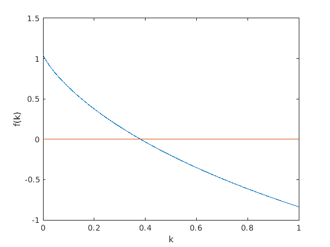

# R script for Negative Binomial distribution

Author: Sid

Date: 2019-10-27

## Method 2

### The Calculation of K

**Solve the equation** to get K
$$
\ln(\frac{N}{N_{0}}) = k\ln(1+\frac{\bar{x}}{k})
$$
We use **Newton-Raphson Method** to get numerical solution

#### Newton-Raphson Method

The core equation is 
$$
x_{k+1} = x_{k} - \frac{f'(x_{k})}{f(x_{k})}
$$
We use iteration to get close.

You can get more detailed instruction from the website below.

:globe_with_meridians:[Brilliant, Newton-Raphson Method](https://brilliant.org/wiki/newton-raphson-method/)

**Code in Matlab**

```matlab
% Author - Ambarish Prashant Chandurkar
%The Newton Raphson Method
clc;
close all;
clear all;
syms x;

######## Note here! You need to change the function according to your problems #########
f=x * log(1 + 5.6/x) - log(100/35); %Enter the Function here
########################################################################################

g=diff(f); %The Derivative of the Function
n=input('Enter the number of decimal places:');
epsilon = 5*10^-(n+1)
x0 = input('Enter the intial approximation:');
for i=1:100
     f0=vpa(subs(f,x,x0)); %Calculating the value of function at x0
     f0_der=vpa(subs(g,x,x0)); %Calculating the value of function derivative at x0
  y=x0-f0/f0_der; % The Formula
err=abs(y-x0);
if err<epsilon %checking the amount of error at each iteration
break
end
x0=y;
end
y = y - rem(y,10^-n); %Displaying upto required decimal places
fprintf('The Root is : %f \n',y);
fprintf('No. of Iterations : %d\n',i);
```

#### Another Method in R

```R
f = function(k) log(N\N0) - k * log(1 + Mean / k)
k = uniroot(f,c(0.001,1))$root
```



<center>the figure of function between [0,1]</center>

Thanks to Sun Sihan. He offered the code.

### The U-test

I have to say, the information about U-test on the PDF (Teacher Shen, 2019) is not good.

I don`t know how to do this part.

This method is proposed by Evans in 1953. I don`t know which paper the teacher referred to, Maybe this one: **D. A. Evans, Statistical Problems Associated with the Analysis of Ecological Quadrat Counts.**


## Method 3

### The Calculation of K

$$
k = \frac{\bar{x}^2 - \frac{\sigma^2}{N}}{\sigma^2 - \bar{x}}
$$

>$ \bar{x} $ : the mean of number of species in quadrats
>
>$\sigma^2$: the variance of number of species in quadrats
>
>$N$ : the number of quadrats


**Code in R**

```R
my_nega_bino3 <- function(a){
  Var = var(a)
  Mean = mean(a)
  k = (Mean^2 - Var/length(a))/(Var - Mean)
}
print(paste("Qingke: k is",my_nega_bino3(number)))
# number is an array, contains population of the species in every quadrats
```


### The chi-square test for goodness of fitting

$$
x^2 = \sum{\frac{(Actual\,Frequncy - Expected\,Frequency)^2}{Expected\,Frequency}}
$$


**Code in R**

```R
my_chi_square_test <- function(number,k){
  Size = k
  Prob = Size / (mean(number) + Size)
  Fre_A = table(A)/sum(number)	# Fre_A is the actual frequency
  Quan = as.integer(names(Fre_A))	# Quan is the population in each quadrat
  Fre_E = dnbinom(Quan,size = Size,prob = Prob)	# Fre_E is the expected frequency
  Chi_square = sum((Fre_A - Fre_E)^2/Fre_E)
}
```

