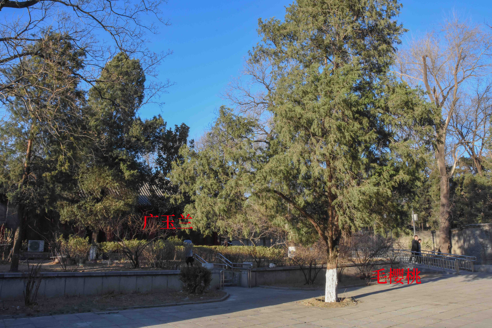

# 物候调查

2019年3月9日，跟了学校绿协的第一次物候调查，回来后开始写物候报告。在调查时拍摄的照片内容乱，故于3月12号将部分照片重拍，并将知识点相关做了特写。整体为回顾的绿协口述内容，因记忆和笔记的方式，不能避免出错，还将逐渐修正；后续按照百度百科补上分类地位的信息。

<!-- more -->

## 松柏纲

X针一束：油松2针一束，白皮松3针一束,华山松5针一束。

### 松科

#### 雪松

* 松科雪松属
* 枝条平展，小枝下垂，好像有雪覆盖枝干
* 叶：小枝叶簇生，大枝叶互生

雪松的叶的两种着生方式

* 地点：静园草坪北侧

雪松的枝干&位置

#### 油松

油松两针一束，斑块状树皮

油松的大孢子叶球

位于二教停车场出口处

#### 白皮松

白皮松三针一束，树皮斑白色

#### 华山松

五针一束

### 柏科

区分圆柏、侧柏、龙柏：

圆柏整体浑圆，龙柏在长到一定的阶段后有螺旋向上的气势，侧柏则长的比较扁平。

#### 圆柏

有鳞片状叶，也有钻状叶。

#### 侧柏

叶片扁平，鳞片状叶，无钻状叶。

## 单子叶植物纲

### 鸢尾科

#### 鸢尾花

- 返青，未见花
- 鸢尾科鸢尾属
- 地点：办公楼东小径

 鸢尾花

## 双子叶植物纲

### 木犀科

#### 迎春花

* 木犀科素馨属
* 枝条：木本，下垂，有四棱实心
* 花：合瓣花，六裂
* 地点：英杰交流中心南侧、综合科研楼西北等

迎春花茎上的棱

与连翘的区分:连翘的枝中空

连翘的枝

位于英杰交流中心南侧

### 梧桐科

#### 梧桐

北大校园内的唯一一株梧桐树。需要与常作为行道树的**法国梧桐**区分。

> 法国梧桐实际为三球悬铃木，因发音与梧桐很像而得名。二球悬铃木是英国梧桐。

- 梧桐科梧桐树
- 茎：树皮光滑泛光，有金属光泽
- 地点：李大钊像

梧桐

### 山茱萸科

#### 山茱萸

古诗中的茱萸指的是“**吴茱萸**”，草本植物，有味道。而山茱萸则是木本，完全没有味道。

- 山茱萸科山竹芋属
- 地点：静园草坪（未开）档案馆前（已半开）

山茱萸的开花情况对比

山茱萸位置

### 芍药科

#### 芍药

- 芍药科芍药属
- 多年生草本植物，冬季地上部分死亡
- 已发现花芽

- 地点：静园草坪东南

芍药的位置

### 豆科

#### 紫藤萝

- 豆科紫藤属
- 地点：燕南食堂与图书馆间走廊

果实螺旋形开裂。

### 腊梅科

#### 腊梅

- 腊梅科蜡梅属
- 花：已经开花，花朝下开
- 地点：南阁南侧

腊梅的位置

### 蔷薇科

#### 棣棠

- 蔷薇科棣棠花属
- 茎：枝条都为绿色，波浪状。
- 花：花期很长，4-11月断断续续开花。有五瓣花，有重瓣花。

 棣棠花

#### 绣线菊

- 蔷薇科蔷薇属
- 花：为花序开花，但尚未观察到花序轴
- 地点：静园草坪

绣线菊的位置

#### 山桃

可以通过樱的花瓣边缘有**缺刻**，而山桃的花瓣是全缘的，以此进行区分。

- 蔷薇科桃属
- 花：花萼红色，5瓣离生
- 地点：三教南、静园

山桃在静园的位置

#### 梅花

已经开花了。可以通过小枝绿色来进行鉴定

- 蔷薇科杏属
- 茎：曲折，小枝绿色
- 地点：静园东南

梅花的位置：照片左侧

#### 毛樱桃

- 蔷薇科樱属
- 地点：燕南园
- 全身被毛(自己观察得出不一样结论，详见照片)

毛樱桃的毛

#### 垂丝海棠

- 蔷薇科苹果属。
- 果实：簇生，柄很长。

垂丝海棠的花柄

- 地点：燕南园

垂丝海棠的位置

> 诗经中提到的木瓜实际指的是海棠果。我们现在吃的木瓜是热带传过来的方木瓜。

### 楝(lian)科

#### 香椿

- 楝科香椿属
- 果实：蒴果，上端有翅，中间是硬化的薄壁组织（类比玉米等植物的茎）。

香椿的果

### 木兰科

木兰属有很多原始的特征，如**螺旋排列、离生、雄蕊不而不定数等**。

区分二乔玉兰、望春玉兰、广玉兰：

- 望春玉兰的花瓣是中间紫色火苗状，周围白色。
- 二乔玉兰则花瓣偏红。
- 广玉兰叶片革质，全年常绿。

望春玉兰的花瓣

#### 望春玉兰

望春玉兰：花苞、初开的花与残留的果皮

望春玉兰：盛开的花

- 木兰科木兰属
- 种子：螺旋排列
- 地点：静园东南

#### 二乔玉兰

- 木兰科木兰属
- 此次未记住所在位置。

#### 广玉兰

也被称为荷花玉兰，通常分布在南方。

- 木兰科木兰属
- 地点：燕南园
- 叶片：革质叶，常绿

广玉兰的革质叶

 广玉兰的位置

### 鼠李科

#### 枣

有短枝，也有密密麻麻开裂的树皮，整体给人一种“刺刺啦啦”的感觉。

- 鼠李科枣属
- 茎：有短枝
- 花期：发育很晚

### 槭树科

槭树科的分类主要通过**叶片几裂**以及**角度**为标准。槭树科果实都是翅果。

#### 鸡爪槭

- 槭属鸡爪槭
- 果实：翅果
- 叶片：七裂

鸡爪槭的叶片

- 地点：燕南园64号

鸡爪槭的位置

### 柿科	

#### 君迁子

又被称为黑枣，但在形态上与柿更加相似。

- 柿科柿属
- 果实：与柿果实非常相似，未成熟时富含单宁
- 花：与柿的花非常相似
- 地点：燕南园

君迁子的位置

### 杨柳科

#### 毛白杨

- 杨柳科杨属
- 果实：

毛白杨的花序

- 地点：网球场东侧

毛白杨的位置

> **后记**
>
> 在参加完绿协的调查后，自己又走了一遍部分路线，再加上调整照片、撰写报告的时间，差不多在4-5小时。收获毋庸置疑，但是总让人担心，花这么多时间写报告，是不是自欺欺人的努力。也无妨，感兴趣又学到东西就OK。

